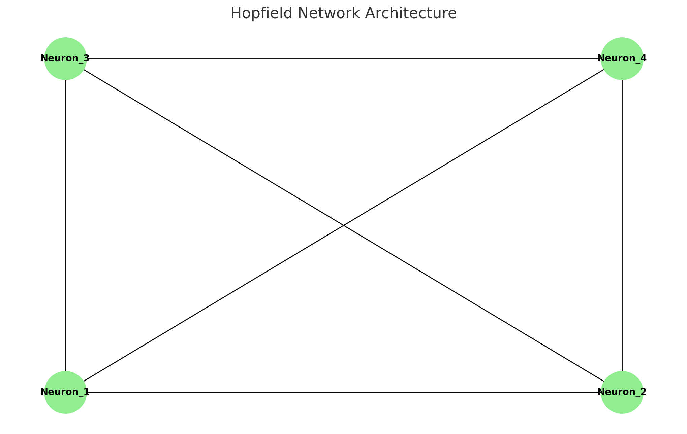

# Neural Network Modeling Lab (PSYC 489) - University of Illinois at Urbana-Champaign

## Introduction

This repository contains assignments for the course "Neural Network Modeling Lab (PSYC 489)" offered at the University of Illinois at Urbana-Champaign. This course delves into the foundational principles and practical applications of neural networks in the context of cognitive psychology and neuroscience. The assignments are designed to offer a hands-on understanding of the algorithms and techniques that underlie neural computation.

### What are Neural Networks?

For those new to the concept, neural networks are a class of machine learning models inspired by the human brain. They are used for various applications ranging from image recognition to natural language processing. At a high level, they consist of interconnected 'neurons' that transmit and process information.

## Technologies Used

- Python
- TensorFlow
- NumPy
- Matplotlib

## Prerequisites

Before running the code, ensure that you have Python 3.x installed along with the necessary packages. You can install the requirements using pip:

```bash
pip install -r requirements.txt
```

## Assignments

### Backpropagation-Autoencoders

#### Theoretical Background

Autoencoders are unsupervised learning algorithms aimed at learning efficient codings or representations of input data. They are neural networks trained to reconstruct their input data as closely as possible. This training paradigm is unsupervised: the network is trained to reconstruct its inputs without requiring any labeled data.

##### Mathematical Representation

The basic Autoencoder architecture can be mathematically represented as follows:

\[
F(G(x)) pprox x
\]

Here, \( F \) is the decoding function and \( G \) is the encoding function.

##### Further Reading

- [Efficient Learning of Sparse Representations with an Energy-Based Model](https://www.jmlr.org/papers/volume11/vincent10a/vincent10a.pdf)
- [Auto-Encoding Variational Bayes](https://arxiv.org/abs/1312.6114)

##### Visual Aid


#### Methodology

The assignment involves creating an autoencoder model and training it using backpropagation. The activation functions, loss functions, and optimization algorithms can be varied to study their impact on the model's performance.

#### How to Run

Navigate to the `Backpropagation-Autoencoders` directory and run the following command:

```bash
python main.py
```

### Hopfield-Network

#### Theoretical Background

Hopfield networks are a type of recurrent neural network used to store one or more patterns. When the network is presented with one of the stored patterns or a part thereof, it can recover the original pattern. This is known as associative memory.

##### Mathematical Representation

The Hopfield network can be described by its energy function \( E \):

\[
E = -\sum_{i,j} w_{ij} x_i x_j
\]

Here, \( w_{ij} \) are the weights and \( x_i \) and \( x_j \) are the states of neurons \( i \) and \( j \) respectively.

##### Further Reading

- [Neural Networks and Physical Systems with Emergent Collective Computational Abilities](https://www.pnas.org/content/79/8/2554)
- [Hopfield Networks: A Short Introduction](https://doi.org/10.3389/fncom.2020.00021)

##### Visual Aid



#### Methodology

The assignment involves implementing a Hopfield network and storing multiple patterns. The effectiveness of the network in recovering the original patterns when fed with partial or noisy patterns is then evaluated.

#### How to Run

Navigate to the `Hopfield-Network` directory and run the following command:

```bash
python main.py
```

## Authors

- [Your Name](mailto:youremail@university.edu)

## License

This project is licensed under the MIT License - see the [LICENSE.md](LICENSE) file for details.
