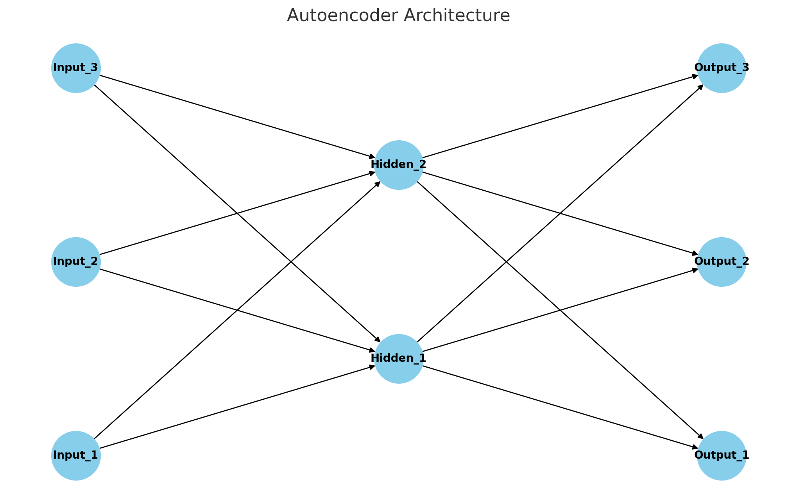
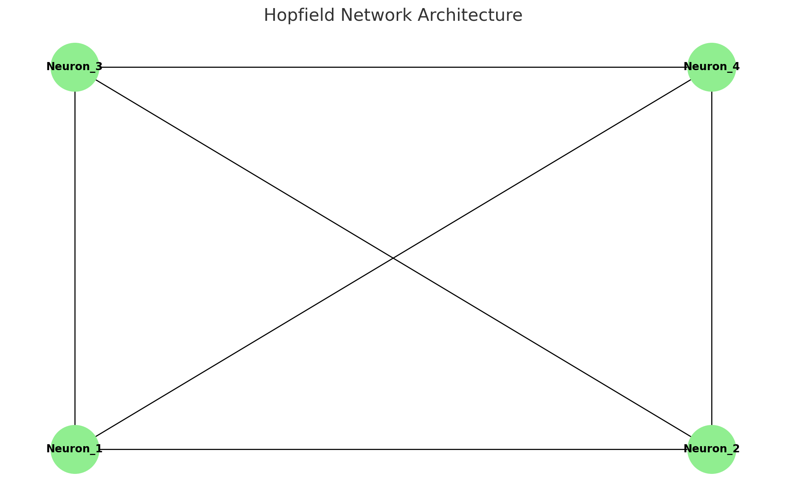

# Neural Network Modeling Lab (PSYC 489) - University of Illinois at Urbana-Champaign

## Scholarly Introduction

As an undergraduate student at the University of Illinois at Urbana-Champaign, this repository serves as my submission for the course PSYC 489: Neural Network Modeling Lab. This course provides a rigorous interdisciplinary approach to the study of neural networks, particularly in the realm of cognitive psychology and neuroscience. It explores both classical and contemporary models, offering insights into biological neural networks and their artificial counterparts.

### Foundations of Neural Networks: A Cognitive Perspective

Neural networks, originally inspired by the architecture and functionalities of the biological brain, serve as powerful computational models capable of learning from data. These networks are not just mere approximators but are grounded in rich theories from cognitive science, computational neuroscience, and statistical physics.

#### Cognitive Psychology

In the realm of cognitive psychology, neural networks are often employed to model various aspects of human cognition, including memory, attention, and language processing. The architecture of these networks—consisting of interconnected nodes or "neurons"—allows for the simulation of complex cognitive processes, providing a more nuanced understanding of human mental faculties.

#### Computational Neuroscience

From a computational neuroscience perspective, neural networks serve as simplified yet robust models that emulate the biological neural circuits. These models offer insights into synaptic plasticity, neural encoding and decoding, and the complex dynamics of neural systems.

### Technologies Employed

- Python
- NumPy
- Matplotlib

## Prerequisites

To run the code in this repository, make sure you have Python 3.x installed along with the necessary packages. You can install the requirements using pip:

```bash
pip install -r requirements.txt
```

## My Submissions

### Backpropagation-Autoencoders

Located in the folder `Backpropagation-Autoencoders`.


#### Theoretical Underpinning: Autoencoders

Autoencoders have garnered significant attention in both academia and industry for their ability to learn efficient codings or representations of data in an unsupervised fashion. At its core, an autoencoder is a neural network trained to reconstruct its input data. This is achieved through a two-part architecture:

1. **Encoder**: This part compresses the input into a latent-space representation. It encodes the input as an internal fixed-size representation in reduced dimensionality. The encoder phase maps the input data to a set of key features that the network identifies as crucial for reconstruction.

2. **Decoder**: This part reconstructs the input data from the internal representation. It maps the encoded data back to the original data space.

The primary aim is to minimize the difference between the input and the reconstructed output. This difference is quantified by a loss function, usually Mean Squared Error (MSE).

##### Mathematical Formulation

The encoder and decoder functions can be represented as `F` and `G` respectively, with `F(G(x)) \approx x`. Here, `F` and `G` are usually affine transformations followed by non-linearities.

``` F(x) = \sigma(W_f \cdot x + b_f) ```
``` G(y) = \sigma(W_g \cdot y + b_g) ```

where ` \sigma ` is a non-linear activation function, ` W_f, W_g ` are weight matrices and ` b_f, b_g ` are bias vectors.

##### Research Implications

Autoencoders have broad applications in various domains:

- **Dimensionality Reduction**: Like Principal Component Analysis (PCA), autoencoders can reduce data dimensions while preserving its structure, albeit in a more powerful and nonlinear manner.
- **Anomaly Detection**: By training on a 'normal' dataset, an autoencoder can reconstruct error when exposed to 'anomalous' data, thereby serving as an anomaly detection tool.
- **Feature Learning**: In the context of deep learning, autoencoders can serve as a feature learning mechanism, where the encoder part can be used as a feature extractor for a more complex task.


For a practical implementation, refer to the Python scripts within the `Backpropagation-Autoencoders` folder:

- [One Layer Autoencoder](./Backpropagation-Autoencoders/One_Layer_Backprop_Autoencoder_NN.py)
- [Two Layer Autoencoder](./Backpropagation-Autoencoders/TwoLayer_Backprop_Autoencoder_NN.py)
  
It is worth noting that several variants of autoencoders exist, such as sparse autoencoders, denoising autoencoders, and variational autoencoders, each with their unique properties and applications.


Autoencoders are neural networks designed to perform data encoding in an unsupervised manner. They are especially useful in dimensionality reduction and feature learning. The architecture typically involves an encoder and a decoder. The encoder compresses the input into a latent-space representation and decodes it back to reconstruct the input as closely as possible.

##### Mathematical Representation

The basic Autoencoder architecture can be mathematically represented as follows: ``F(G(x)) ≈ x``

Here, `F` is the decoding function and `G` is the encoding function.

#### Running the Code

Navigate to the folder `Backpropagation-Autoencoders` and execute the Python scripts:

- `One_Layer_Backprop_Autoencoder_NN.py`
- `TwoLayer_Backprop_Autoencoder_NN.py`

### Hopfield-Network

Located in the folder `Hopfield-Network`.


#### Theoretical Framework: Hopfield Networks

Hopfield Networks are a particular type of recurrent neural network that serves as a model for associative memory or content-addressable memory. The network can store multiple memory patterns and retrieve the full memory when a partial or noisy version is input.

##### Architecture

A Hopfield network consists of a single layer of neurons connected to each other (excluding self-connections). Each neuron is binary and can take on values of either +1 or -1. The network evolves by updating the states of neurons based on the weighted sum of its connected neurons.

##### Mathematical Formulation

The dynamics of a Hopfield network are governed by an energy function ` E `, defined as:

``` E = -\sum_{i,j} w_{ij} \cdot x_i \cdot x_j ```

where ` w_{ij} ` is the weight between neuron ` i ` and ` j `, and ` x_i ` and ` x_j ` are the states of neurons ` i ` and ` j ` respectively. The network aims to minimize this energy function.

##### Research Implications

Hopfield networks have been utilized in various scientific explorations:

- **Memory Models**: In cognitive psychology, they serve as models for human memory and offer insights into how memories can be recalled or forgotten.
- **Optimization Problems**: They are used in solving optimization problems where the network can evolve to a state that represents the optimal solution.
- **Pattern Recognition**: In machine learning and computer vision, Hopfield networks have been used for pattern recognition tasks.

##### Advanced Concepts

- **Energy Landscapes**: The concept of energy landscapes is central to understanding Hopfield networks. The network moves toward stable states, which are local minima in the energy landscape.
For a practical implementation, refer to the Python script within the `Hopfield-Network` folder:

- [Hopfield Network](./Hopfield-Network/Hopfield-Network.py)

- **Capacity**: The number of patterns that a Hopfield network can store is approximately 0.15 times the number of neurons, beyond which the network starts to produce spurious patterns.



It's crucial to note that while Hopfield networks are good at certain tasks, they are not as versatile as other neural network architectures like feedforward and convolutional neural networks.


Hopfield networks serve as models for associative memory. They are designed to converge to a stable state and can recall entire patterns based on partial input. This capability is especially useful in modeling memory and pattern recognition tasks.

##### Mathematical Representation

The Hopfield network can be described by its energy function `E`: ``E = -∑(i,j) w_ij * x_i * x_j``

Here, `w_ij` are the weights and `x_i` and `x_j` are the states of neurons `i` and `j` respectively.

#### Running the Code

Navigate to the folder `Hopfield-Network` and execute the Python script:

- `Hopfield-Network.py`

## Author

- [Eric Soderquist](mailto:eys3@illinois.edu)

## License

This project is licensed under the MIT License - see the [LICENSE.md](LICENSE) file for details.

## Challenges Encountered

Throughout the course, several challenges were encountered that significantly contributed to the learning experience:

1. **Dimensionality Curse**: Implementing autoencoders necessitated a deep understanding of how to efficiently manage high-dimensional data.
2. **Model Convergence**: Achieving quick and stable convergence in Hopfield networks required fine-tuning the model parameters.
3. **Computational Complexity**: Due to the recurrent nature of Hopfield networks, computational resources were often a constraint.

## Lessons Learned

1. **Feature Importance**: The importance of feature selection and dimensionality reduction in neural network architectures.
2. **Hyperparameter Tuning**: Gained hands-on experience in tuning neural network parameters for optimal performance.
3. **Interdisciplinary Knowledge**: The course enriched the understanding of how neural network models are used in various scientific disciplines.

## Future Research Directions

1. **Optimization Algorithms**: Exploring more efficient optimization algorithms for training neural networks.
2. **Model Interpretability**: Investigating techniques for making neural network models more interpretable.
3. **Real-world Applications**: Applying the theoretical knowledge gained in the course to real-world problems in cognitive psychology and neuroscience.
